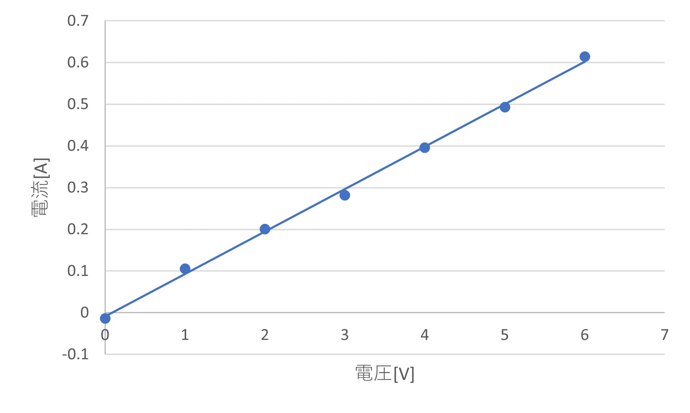
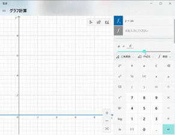
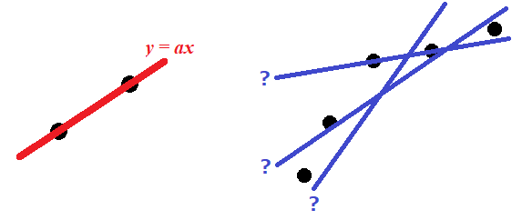
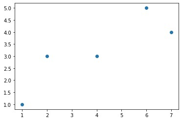
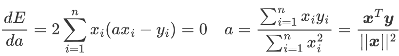
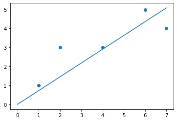
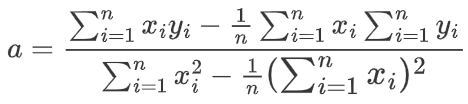

# 1-2. 線形回帰
線形回帰は比例関係に近い2つの変数の関係性をモデル化することです。教師あり学習の中で最も基本的なアルゴリズムと言ってもよいでしょう。  

比例関係に<u>近い</u>と表現する理由は，xy平面上にデータをプロットしたときにカッチリと全てのデータが一直線上に並ぶことはまず無く，実際はもっともらしい直線を引くことになるからです。

<div align="center">
図2-1-1. オームの法則の実験で得られた電流・電圧のデータをプロットしたもの。  

測定誤差によって少しばらつきが見られるが，もっともらしい直線で結ぶ。  

  
</div>

## 1-2-1. 原点を通る直線で予測

### $y=ax$ のグラフ
おさらいですが，原点を通る直線は $y=ax$ という方程式で表されます。これは中学校で習う1次関数の一種になります。  
$a$ は直線の **傾き** と呼ばれ，この値によって傾きが決定されます。0であればx軸に平行な直線となります。  

<div align="center"></div>

### もっともらしいグラフを引くには
$y=ax$のグラフは2点のデータを結ぶように直線を引けば良いので，その傾きを表す $a$ の値は $\frac{y方向への移動}{x方向への移動}$で求められます。  
一方，線形回帰を行う場合はデータが多かったり，そもそも一直線上に並んでいないので別の手段で $a$ を求める必要があります。その手段が **最小二乗法** です。  

<div align="center"></div>  

### 最小二乗法
最小二乗法に用いられるデータとして二乗誤差があります。二乗誤差とは $y=ax$の直線とデータの点（厳密には目的変数y）との距離（誤差）を二乗したものです。  
なぜニ乗するのかというと，距離を求める時に引き算をするため，符号が+,-両方生じることがありますので，二乗することで全ての符号を+に統一します。  
線形回帰では，全データの二乗誤差の合計が最も小さくなる $a$ を求めて直線を引くことになります。  

### 二乗誤差の最小化方法
直線を引くための $a$ を求める方法を説明する前に，計算に関する知識を確認しましょう。  
ここでは，説明変数 $x$ と目的変数 $y$ のデータセットを次のような行列（1列なのでベクトルともいえます）で表現します。

$$
\boldsymbol{x}=
\begin{bmatrix}
x_1\\
x_2\\
︙\\
x_n
\end{bmatrix}
,
\quad
\boldsymbol{y}=
\begin{bmatrix}
y_1\\
y_2\\
︙\\
y_n
\end{bmatrix}
$$

分かりやすいように，具体的な数値を入れてみます(n=5)。  

$$
\boldsymbol{x}=
\begin{bmatrix}
1\\
2\\
4\\
6\\
7
\end{bmatrix}
,
\quad
\boldsymbol{y}=
\begin{bmatrix}
1\\
3\\
3\\
5\\
4
\end{bmatrix}
$$

これは，xy座標で表現すると $(x,y) = (1,1), (2,3), (4,3), (6,5), (7,4)$ となり，散布図で次のようになります。  

<div align="center"></div>  

ここに二乗誤差の合計が最小となる直線を引きます。

### ○ 式の導出 ○
線形回帰に用いる直線とデータとの距離の合計を $E$ とします。すると，全データ(n=5)の誤差の合計は  

$$
E=\sum_{i=1}^{n}(ax_i-y_i)^2
$$

で表されます。  

 $ax_i$ は説明変数が $x$ のときの $y$ の値，つまり直線上の1点を指し， $y_i$ は実際のデータの目的変数ですので，これらを引き算 $(y-y_i)$ することで距離が求まります。  
これを二乗し全データの総和を求めています。  

この $E$ を最小化する方法ですが， $E$ を $a$ の関数とみなして（ $x_i, y_i$ は変数ではないので，変数は $a$ のみ）， $a$ で微分した結果が0となる $a$ を求めます。  
※ 最小値を求める方法は高校数学で習う極値の計算と同じです  

<div align="center"></div>  

<!--
$$
\frac{dE}{da}=2\sum_{i=1}^{n}x_i(ax_i-y_i)=0 \\
\quad \\
a = \frac{\sum_{i=1}^{n}x_i y_i}{\sum_{i=1}^{n}x_i^2}=\frac{\boldsymbol{x}^T\boldsymbol{y}}{||\boldsymbol{x}||^2}
$$
-->

ここで， $\boldsymbol{x}^T \boldsymbol{y}$ は行列同士のドット積ですが， $\boldsymbol{x}$ を転置（n行1列から1行n列へ）しているので，結果はベクトルではなくスカラーになります。上で用いた数値を用いると，

$$
\boldsymbol{x}^T  \boldsymbol{y} =
\begin{bmatrix} 1 & 2 & 4 & 6 & 7 \end{bmatrix}
\begin{bmatrix} 1\\
3\\
3\\
5\\
4
\end{bmatrix} \\
\quad \\
=(1×1)+(2×3)+(4×3)+(6×5)+(7×4)=77
$$

となります。  
また， $||\boldsymbol{x}||^2$ はノルムといい，ベクトルの大きさを表します。これは次のように計算します。

$$
||\boldsymbol{x}||^2=x_1^2+x_1^2+\dots+x_n^2
=1^2+2^2+4^2+6^2+7^2=106
$$

よって，

$$
a = \frac{\boldsymbol{x}^T\boldsymbol{y}}{||\boldsymbol{x}||^2} = \frac{77}{106} = 0.72641… 
$$

直線の傾き $a$ が求まりました。  
実際に先ほどの散布図に直線のグラフを重ねてみると次のようになります。    

<div align="center"></div>  


## 1-2-2. Pythonでの実装
前項の計算をPythonで実装しましょう。データセットの用意と散布図の表示は次のように行います。  
```python
import numpy as np
import matplotlib.pyplot as plt

x = np.array([1, 2, 4, 6, 7])
y = np.array([1, 3, 3, 5, 4])

plt.scatter(x, y)
```

<div align="center"></div>  

次に，行列同士のドット積として`np.dot()`，総和計算として`.sum()`メソッドを使い，aを求めます。  

$$
a = \frac{\boldsymbol{x}^T\boldsymbol{y}}{||\boldsymbol{x}||^2}
$$

```python
a = np.dot(x, y) / (x**2).sum()
print("a={}".format(a))
```

最後に，散布図に直線のグラフを重ねます。`x.max()`はxのリストから最大のものを取り出すメソッドで，グラフの表示範囲全体に直線を引きます。
```python
plt.scatter(x, y)
plt.plot([0, x.max()], [0, a*x.max()])
plt.show()
```

<div align="center"></div>  


## 課題
1. 次の訓練データから学習パラメータ $a$ が2.0（float型の場合）となることを確認してください。  

$$
\boldsymbol{x}=
\begin{bmatrix}
1\\
2\\
3\\
4\\
5
\end{bmatrix}
,
\quad\boldsymbol{y}=
\begin{bmatrix}
2\\
4\\
6\\
8\\
10
\end{bmatrix}
$$

2. 切片 $b$ を含む直線のグラフ $y=ax+b$ を線形回帰に使う場合，学習パラメータ $a,b$ は次のように求められます。  

<div align="center"></div>  

<!--
$$
a=\frac{\sum_{i=1}^{n}x_i y_i - \frac{1}{n} \sum_{i=1}^{n}x_i \sum_{i=1}^{n}y_i}{\sum_{i=1}^{n}x_i^2 - \frac{1}{n} \large( \sum_{i=1}^{n}x_i\large)^2} \\
\quad \\
$$
-->

$$
b=\frac{1}{n}\sum_{i=1}^{n}(y_i-ax_i)
$$

これを用いて，次のプログラムを完成させてください。

```python
import numpy as np
import matplotlib.pyplot as plt

x = np.array([1, 2, 4, 6, 7])
y = np.array([1, 3, 3, 5, 4])

n = len(x)
a = 【ここにプログラムを追加する】
b = 【ここにプログラムを追加する】

plt.scatter(x, y)

xmax = x.max()
print("a={}, b={}".format(a, b))
plt.plot([0, xmax], [b, a*xmax + b])
plt.show()
```

3. 線形回帰がうまく当てはまらない例を挙げて考察を述べてください。
