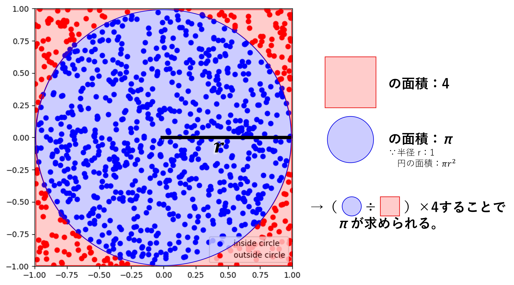

# 1-5. モンテカルロ法

モンテカルロ法は、乱数を用いてシミュレーションを行い、数値計算を行うことを指します。  
これを行うことで、解析的に求められない事象でも近似的に数値解を出すことができます。具体的には、円周率やネイピア数（無限小数）、数値積分などがあります。  

今回はモンテカルロ法を使って円周率 $3.14$ …を求めるPythonのプログラムを作成してみましょう。  

## 1-5-1. 円周率の定義

円周率 $\pi$ は名前の通り、「円周の長さ」と「円の直径」との比を表します。  

$$
（円周率）= \frac{（円周の長さ）}{（円の直径）}
$$

これを変形すると、

$$
（円周の長さ）= （円の直径）×（円周率）
$$

となり、直径 $R$ の円の円周は   $\pi R$と表せます。  
（半径 $r$ の場合の円周は   $2\pi r$になります）  


$\pi$ の具体的な数値が有名な $3.14$ …ですが、無限小数であり全てを書きあらわすことができないので、中学校以降は文字を使って表現します。  


## 1-5-2. モンテカルロ法で円周率を求める原理

モンテカルロ法で円周率を求めるために、図形的に考えていきます。次の図を見てください。  


原点を中心とした、x,yいずれも-1~1の範囲の正方形を考えます。これに、原点を中心とした半径1の円を重ねます。  
この領域にランダムに点を配置し、その点が円の領域内か領域外かで色分けしています。  

この点の個数はそれぞれの面積と本質的に同じなので、

$$
（円周率）=\frac{（円の領域内の点の個数）}{（正方形内の点の個数）}×4
$$

で、円周率を求めることができます。  
※（正方形内の点の個数）は打った点の個数に等しい

## 1-5-3. Pythonでの実装

実際に、-1~1の範囲で点をランダムに配置してみます。次のプログラムを実行してください。  

```python
import random
import math
import matplotlib.pyplot as plt

# ランダムに点を配置する試行回数
num_points = 1000

# 点の座標を格納するリスト
points_square_x = []
points_square_y = []

# ランダムな点データを生成してリストに追加
for i in range(num_points):
    points_square_x.append(random.uniform(-1.0, 1.0))
    points_square_y.append(random.uniform(-1.0, 1.0))

# 散布図を描画
plt.figure(figsize=(6,6))
plt.scatter(points_square_x, points_square_y, color='k')
plt.xlim(-1, 1)
plt.ylim(-1, 1)
plt.show()
```

これを実行すると、  


という散布図が得られます。  

次に、これらの点が円の領域内であるかどうか判定する機能を追加します。以降、ライブラリのインポートを省略していることに注意してください。    

```python
# ランダムに点を配置する試行回数
num_points = 1000

# 円の領域内に存在する点の個数を保存する変数
points_inside_circle = 0

# 点の座標を格納するリスト
points_square_x = []
points_square_y = []

for i in range(num_points):
    points_square_x.append(random.uniform(-1.0, 1.0))
    points_square_y.append(random.uniform(-1.0, 1.0))

    # 原点からの距離を三平方の定理で求めて、1以下となれば円の領域内と判定
    if math.sqrt(points_square_x[i]**2 + points_square_y[i]**2) <= 1.0: 
        points_inside_circle += 1

# 円の領域内の点の個数を表示
print(points_inside_circle)
```

これを実行すると、およそ750-800程度の値が出ると思います。  

では最後に、円の領域内の点の個数と、配置した点の総数を用いて円周率を求めてみましょう。  
先ほどのプログラムの最後の行を次のように修正してください。

```python
# 円の領域内の点の個数と、配置した点の総数を用いて円周率を求める
print(points_inside_circle * 4 / num_points)
```

これで、モンテカルロ法を使って円周率を求めることができました。  

配置する点を増やすことで精度が上がります。なお、ランダムで点を配置しているので、実行ごとに結果は変化します。色々試してみましょう。

### 参考
円の領域内かどうかで格納するリストを振り分けることで、Matplotlibの表示を色分けできます。  
次のプログラムを実行してください。  

```python
# ランダムに点を配置する試行回数
num_points = 1000

# 円の領域内に存在する点の個数を保存する変数
points_inside_circle = 0

# 点の座標を格納するリスト
points_circle_x = []
points_circle_y = []
points_square_x = []
points_square_y = []

for _ in range(num_points):
    x, y = random.uniform(-1.0, 1.0), random.uniform(-1.0, 1.0)
    # 点が原点からの距離が1以下（円内）であるか確認
    distance = math.sqrt(x**2 + y**2)
    if distance <= 1.0:
        points_inside_circle += 1
        points_circle_x.append(x)
        points_circle_y.append(y)
    else:
        points_square_x.append(x)
        points_square_y.append(y)

# 円の領域内の点の個数と、配置した点の総数を用いて円周率を求める
print(points_inside_circle * 4 / num_points)

# 散布図を描画
plt.figure(figsize=(6,6))
plt.scatter(points_circle_x, points_circle_y, color='b', label='inside circle')  # 円内の点
plt.scatter(points_square_x, points_square_y, color='r', label='outside circle')  # 円外の点
plt.legend() # 凡例を表示
plt.xlim(-1, 1)
plt.ylim(-1, 1)
plt.show()
```


## 1-5-4. 練習
ネイピア数（自然対数の底） $e=2.71$ …をモンテカルロ法で求めてみましょう。  

* $0 \leq x \lt 1$ の範囲でランダムな値を加算し、1以上になるまでの加算した回数を数える
* その加算した回数の平均を取ると $e$ が求まる。

以下の"______"部分に適切な数値やコードを入れてプログラムを完成させてください。

```python
# モンテカルロ法でネイピア数を求める

count_of_try = 1000 # 平均を取る回数
count = 0 # 加算回数

for i in range(count_of_try):
    temp = 0
    while temp <= ________:
        temp += ________ # tempに0~1の乱数を加算
        count +=1 # 加算回数を1増やす

print(count / count_of_try)
```
